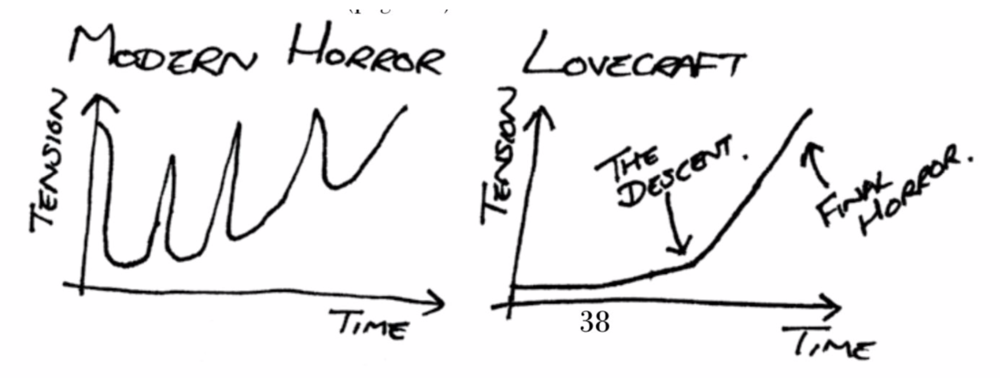

# The Black Vault Rehearsal Notes for August 7, 2019

## Objectives

1. Understand basic Lovecraftian story structure
2. Understand the three basic styles of HPL stories
3. Practice the tone of Lovecraftian horror
4. Talk about Lovecraftian themes
5. Make sure everyone has filled out availability. :)

## Overview

### Warmups

* Walk around the space!
  * We'll be starting off every rehearsal with some variation on this
  * Walk into empty space, soft focus, starts and stops
* Check-ins, stretches, talk about what we're covering today
  * Safety/consent review
    * Cut/Brake (just say it for now), the door is always open, anonymous feedback
    * Intimacy/violence is "office casual", for now
    * The "Horns of Silence" are for everyone, not just me, to pull the emergency brake

### Lovecraftian Themes and Tropes

* Line up in order of familiarity with Lovecraft
* Get into pairs (matching for average familiarity) and talk about HPL's themes/tropes
* Circle back up and talk about what we think the core themes of Lovecraft stories are
  * Body horror, things that are Too Big, isolation, wild names, ancient languages, things you carry with you, protagonist is not special or likeable, big scope, small humans, starting from the end, academics/scientists, big lists of things, archaeology, Poe, surrealism/dream-like quality, colorful vocabulary

* Lovecraftian Themes: the "meat" on the bones of the structure skeleton
  * Threat to "normality"
  * Violation of boundaries
  * Horrific discoveries / self-discoveries
  * Fear of the unknown
  * Vast scope
  * Isolation

### Lovecraftian overall story structure

* Begins with a mundane character introducing themselves, normal/pastoral location or event
* Discover something unusual - or get a letter, get word from an old friend, etc
* Investigate and follow the thread
  * Every step is plausable and reasonable, for starters
  * Narrator investigates because of one of more "Drives" - connection to another character, some sort of motivation
  * Slowly ratchet up the tension and dread - "The Descent"
* Eventually discover the "Final Horror"
  * death, madness, imprisonment, suicide
  * realizing that you/mankind must live with the horrible knowledge discovered

* Practice with HPL story spine
  * Do in first person, past tense
  * Practice in pairs, and as a group
  * Allow for discovery in location, characters, self
  * The narrator *always* loses
    * Try the "not only that" make it worse game

* HPL Story Spine
  * Once upon a time, there was [fairly innocuous character]
  * Every day, they would [go about their innocuous business]
  * Until one day, they [discovered some small indication something is not right]
  * And every day...
    * They investigated a bit further, and discovered worse and worse things
    * Repeat a bunch, until...
  * Finally, they discover or encounter the final horror
  * And they die, or go mad, or live with the horror somehow
  * (Extra credit: you tease the narrator’s terrible end in the opening of the story)

[Lovecraft plot vs "modern" horror - CHART!](../assets/BlackVaultPlotChart.png)

* Tone - fated, but not dour
* Avoiding the monotone deep-voice intonation - vary emotion, tone, attitude, pitch

### Types of stories
  * **"Weird Horror"**
    
    Tales of horrible doings moored in such horror tropes as reanimation of the dead, infestation, mind control, or madness. This is where we encounter human-scale aberrations like cannibals, cultists, necromancers, various monsters and ghouls, old men who have lived too long, and unnatural things discovered in one’s family line.

  * **"Dreamscape"**

    Following the style of Lovecraft's "Dream Cycle," these stories focused on the inner life of the dreaming mind, usually with a fantasy or science fiction bent. 

  * **"Cosmic Horror"**

    As in the stories in Lovecraft's "Cthulhu Mythos," these stories focused on unknowable and largely unseen forces from beyond the stars, represented on Earth by mysterious cults and strange ancient artifacts. These also include the doomsday cults that worship these elder gods, and far flung visions (or visitations) of the past, future, or distance spaces that they inhabit.

## Other announcements

* Let's avoid the use of "crazy" to describe losing one's mind. Be more specific, etc.
* Start thinking about costumes
  * [Pinterest board!](https://pin.it/cqz5kqjkbpq6tp)
* No rehearsal on Wed, 9/4
* See you on Sunday!
