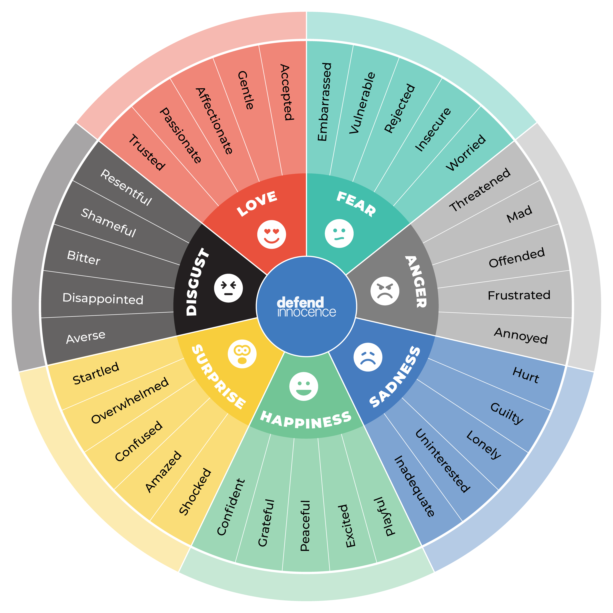

# The Black Vault Rehearsal Notes for Sunday August 11, 2019

## Objectives

1. Be able to narrate a Lovecraft-style story
2. Tell a story inspired by personal experience
3. Use varied emotion and tone in storytelling

## Overview

### Warmups

* Walk around the space!
  * Soft focus, starts and stops
  * Play with tempo - half speed, quarter speed, double speed - pick/converge on speed
  * Stretches - thanks, Suzanne!

### Narrating in Lovecraft Style

* Lots of details
  * Use sensory details, emotional feelings, memories, metaphors/similies
    * Use impro shakespeare trick of "It was like..." pick any word, then justify
  * Stay in a moment for "too long", use long pauses (don't know what to say => dramatic pause!)
  * First person, past tense, enter story
* Practice describing / scene painting a location
  * Greenhouse, old desert cave
  * Hold off on any action, just describe the moment
    - senses, metaphor, "it reminded me of"
  * Lovecraft knew New England very well - use details of places you're personally familiar with

### Creating Lovcraftian stories from personal experience

* In pairs, tell personal anecdote, about 60 seconds long
  * Switch pairs, retell the story you heard, switch again, repeat, tell in group
  * What parts of the story stuck? What were the important points? The "bones" of the story?
  * What parts were dropped? What did you misremember or re-interpret of focus on?
* In a group, one person tell a personal anecdote
  * Someone else retell the story, adding about 20% Lovecraftian detail, emotion, etc
  * Someone else retell the story, upping to about 50% details, senses - don't make it worse yet
  * Someone else retell the story, beginning with a feeling of dread and carrying that through
    * Continue adding strong details, emotions, senses, memories, metaphors, philosophy
  * Retell the story one last time, starting with intro, ramping up to a Final Horror at the end
    * Intro can be personal introduction (I am xxx, and I blah blah blah), history, philosophy, etc
  * This is all describing a moment, without action, progressively getting more Lovecrafty
* Split into new pairs, one person start with an anecdote, and switch back and forth, running through the progression together

### Using varied emotion and tone in narrating

* To avoid monotone / stentorian tone, vary qualities of voice 
  * Volume - louder/softer
  * Pitch - higher/lower
  * Emotion - mad/glad/sad/afrad/disgust/surprise/etc
  * Speed/tempo - faster slower
  * Slow/quick changes in tone
* Read text from a random HPL story with a partner prompting you to change one or more of your vocal qualities
* Try the exercise with an improvised story
* Listen to yourself like you'd listen to someone else
* Be Affected by your own story! React to it, be surprised
* Try word-at-a-time story solo, to get a feel for what that might be like

* [Vocal Viewpoints](../assets/VocalViewpoints.pdf)
  * Pitch - low/high
  * Dynamic - volume up/down
  * Tempo and Duration
  * Timbre - physical location of sound
  * Shape - round/flat/sharp/etc
  * Gesture
    * Expressive - emotional, hmm, huh
    * Behavioral - throat clearing, yawning, etc
  * Architecture
  * Repetition
  * Kinesthetic Response, Silence, etc

[Wheel! Of! Emotions!](../assets/EmotionWheel.png)

## Other announcements

* Costume/style [Pinterest board!](https://pin.it/cqz5kqjkbpq6tp)
* See you on Wednesday!
